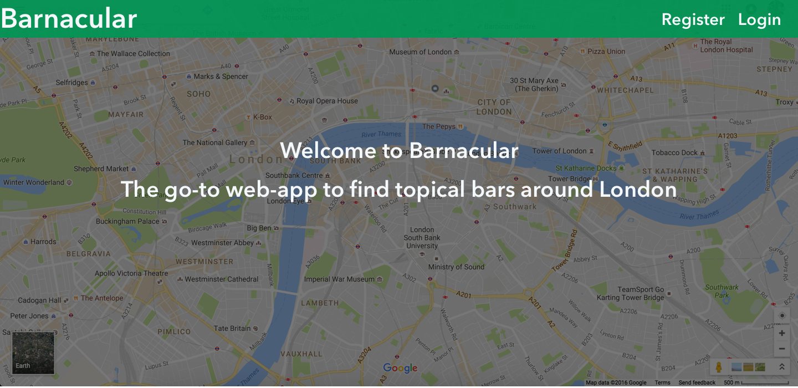
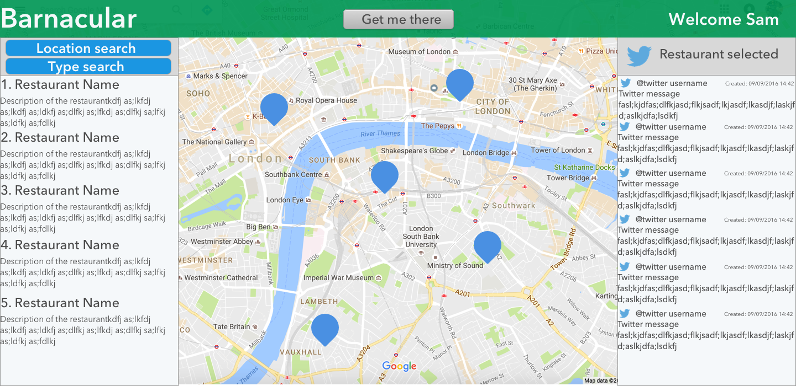

# General Assembly: wdi-project-2
====

##BarPleeze: A GoogleMaps website integrating another data API

<https://github.com/samyounger/wdi-project-2> | <http://barpleeze.herokuapp.com/>

####Contact me
>LinkedIn: <https://uk.linkedin.com/in/sam-younger-21674714>

>Twitter: <https://twitter.com/aYoungerSage>

>Git: <https://github.com/samyounger>

>Email: <sam.younger@gmail.com>

## Assignment
**Description:** Design a website which uses google maps to display location and information using a secondary data source. The site should provide authentication for users.

### Chosen topic
**Descrition:** A program which pulls in the GoogleMaps API. The user can search by location for places of interest and by topic e.g. restaurant etc. Once the target destination has been chosen, recent commentary is listed relating to the location, and events happening nearby for additional entertainment.

The map is restricted to London only.

---

### Initial User experience planning
1. The homepage is blank with a title & description
2. The user registers with:
	* Username
	* Email address
	* Password
	* Password confirmation
3. The user logs in using username & password
	* This opens the map and full functionality
4. User enters destination in box 1
5. User enters type of destination from a fixed list:
	* Restaurant
	* Pub
	* Cafe
6. The website returns 5x recommendations. Listed is:
	* place name
	* place characteristics; pub, restaurant, library
	* photo of the place
	* link to the place website
	* description of the place
	* a link to facebook/twitter feed?
7. User selects one of the 5 recommendations
8. The website returns on the map directions to the destination. The user can select transport by:
	* Car
	* Bicycle
	* Public transport
9. The website returns all recent tweets related to the place name
10. The map highlights trending events closest to the destination (optional time depending)

**Additional points:** the site should be mobile responsive, with a fast reload. Probably best to use bootstrap for quick mobile responsive design, and limited use of images.

---

### Application Programming Interfaces to use:

1. **Google maps:** [Link] (https://developers.google.com/maps/documentation/javascript/)
	* Geolocation: [Link] ()
	* Places: [Link] (https://developers.google.com/maps/documentation/javascript/places)
	* Directions: [Link] (https://developers.google.com/maps/documentation/javascript/directions)
	* Transit layer: [Link] (https://developers.google.com/maps/documentation/javascript/trafficlayer)
3. **Twitter API:** [Link] (https://dev.twitter.com/rest/public)
	* The Search API: Tweets by place [Link] (https://dev.twitter.com/rest/public/search-by-place)
		- You can search for Tweets about places using the place operator of the Search API.
	* Get trends/closest [Link] (https://dev.twitter.com/rest/reference/get/trends/closest)
		- Returns the locations that Twitter has trending topic information for, closest to a specified location.
4. **TFL:** If time is left, integrate the TFL library for London.
	* If google maps does not offer high quality transport information, see how easy it is to integrate TFL transport information. [Link] (https://api.tfl.gov.uk/)

---

###Styling

Colour Palette: #6598CF;

- use SASS darken/lighten to change variations of the primarliy colour

Fonts: font-family: 'Fontdiner Swanky', cursive;

---

###Thinking through the problem

**Authentication:**

- The page is produced on one html page. All new pages are rendered through JavaScript
- A profile needs to be created for the user
- The user has the ability to 'favourite' a restaurant, which saves to their array

**The Map**

- Search bar with google places, to search for just Bars
	* Google places needs to reverse geocode the location by name
- The search needs to return only 5x recommendations, no more
- All 5 should be listed with a description, and a marker on the map
	* is it possible to give a specialised icon to each of the 5?
- The map should be able to locate where you are, and give a tfl transport recommendation to get there. Too difficult? Maybe just walk
- The map should provide a description of the bar and a photo

**Twitter**

- The name of the bar is placed into the API search by keyword, and all the latest tweets appear (from last 7 days I believe)

**Favourites**

- The user has the ability to favourite a bar. This saves all the details to their profile for later reference

---

###WireFrame

The project wireframe was designed using the application Sketch.

---

##Starting the APP

Languages used:

- HTML
- CSS/SASS
- Bootstrap
- Javascript
- JQuery
- ExpessJS
- NodeJS
- AJAX
- MongoDB
- JWT Authentication
- Bower & Gulp

The app has been uploaded to Heroku here:

<http://barpleeze.herokuapp.com>

###Use it locally:

1. Install Mongo onto your local machine using NPM
2. Type `mongod` into the console to activate the mongo database
3. Ensure node package manager (npm) is installed locally on your machine.
4. In the console navigate to the root of where the file is saved.
5. In a new terminal window type `npm i`. This installs all required packages.
6. Type `bower i` to install any language packages required such as jQuery & bootstrap.
	- you may need to install Bower globally on your local machine, type `npm i bower -g` into the console to do this.
7. In the terminal type `gulp`. This will launch the app on `http://localhost:3000/app`.
8. In the brower go to the above address to view the app.
9. To enable access to the info-Windows when clicking the bar icons on the map, you must register and login.

---

##Outcome

###Review of the project

I achieved most of the functionality that I set out to achieve. The user is able to:
- register and login/logout
- scroll through google maps
- use google places to search any area in the world for nearby bars
- use a search bar to search geographical areas
- get an info window up on bars selected giving a photo, url, user reviews of the bar, and a favourites button
- the favourites button saves bars to the users database to be recalled later
- a button to recall all the users favourite bars
- a button to recall all bars favourited across all users
- a list on the right of the screen which lists all the bars visible, and they can be clicked to open the infoWindow of that bar

###Name Change

After testing the name out with the class, the play on the word 'vernacular' was not immediately obvious, and it was therefore changed to a more direct name 'BarPleeze'.

###Functionalities not achieved 

I did not use the google directions functionality as it only covered foot or vehicle directions, and I did not think this would enhance the UX particularly.

I decided not to limit the bar recommendations to 5, to make it more interesting.

The Twitter API required OAuth which I have not used before. It took me longer than expected to get the google places API functionality to work, which ate into the twitter dev time. I therefore spent the remaining time of the project focusing on styling to ensure a nice user experience.

Likewise there was not time to use the TFL API.

###Styling
The final styling of the project is quite different from the wire-frame, but the broad layout is the same. The primary colour of the project was changed, for no particular reason other than I preferred the blue selected.
The styling was primarily done using Bootstrap. Foundation was attempted however it has recently been updated and there was clash between bower, jquery and foundation, which required an older version of jquery. Given at that point I had already coded the functionity, there was no point using an old version of jquery.

##Follow up

**API's:** Using third-party API's was harder than expected and took longer than expected. Next project spend more time experimenting with the API's in the planning phase using Insomnia (`https://insomnia.rest/`)

**RESTful Routes:** Integrating user authentication into the project made it harder to loop through the RESTful routes. This particular part highlighted to me that I need a greatinger understanding REST routing, connecting the front-end App with the back-end API.

**Styling Frameworks:** I have not used styling frameworks before to any great extent, so this was the first project used properly. I wasted quite a bit of time styling the site using SASS, in particular integrating a modal. Once a boostrap framework was used this sped up project styling implementation immensely.